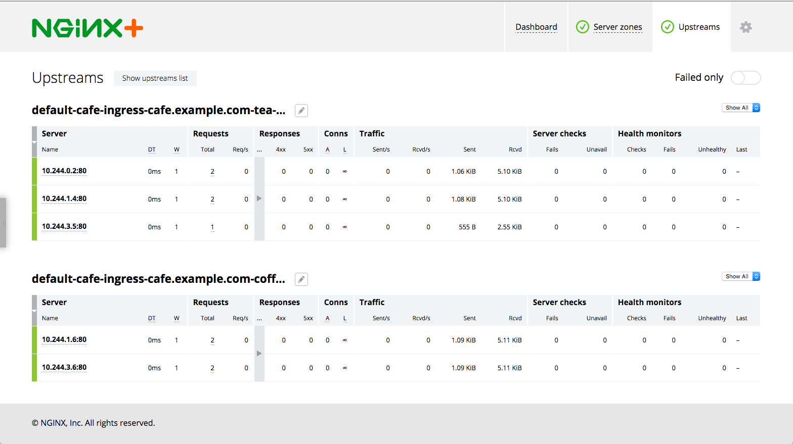

# Example

In this example we deploy the NGINX or NGINX Plus Ingress controller, a simple web application and then configure load balancing for that application using the Ingress resource.

## Running the Example

## 1. Deploy the Ingress Controller

1. Follow the installation [instructions](../../docs/installation.md) to deploy the Ingress controller.

1. Save the public IP address of the Ingress controller into a shell variable:
    ```
    $ IC_IP=XXX.YYY.ZZZ.III
    ```

## 2. Deploy the Cafe Application

Create the coffee and the tea deployments and services:
```
$ kubectl create -f cafe.yaml
```

## 3. Configure Load Balancing

1. Create a secret with an SSL certificate and a key:
    ```
    $ kubectl create -f cafe-secret.yaml
    ```

2. Create an Ingress resource:
    ```
    $ kubectl create -f cafe-ingress.yaml
    ```

## 4. Test the Application

1. To access the application, curl the coffee and the tea services. We'll use ```curl```'s --insecure option to turn off certificate verification of our self-signed
certificate and the --resolve option to set the Host header of a request with ```cafe.example.com```
    
    To get coffee:
    ```
    $ curl --resolve cafe.example.com:443:$IC_IP https://cafe.example.com/coffee --insecure
    Server address: 10.12.0.18:80
    Server name: coffee-7586895968-r26zn
    ...
    ```
    If your rather prefer tea:
    ```
    $ curl --resolve cafe.example.com:443:$IC_IP https://cafe.example.com/tea --insecure
    Server address: 10.12.0.19:80
    Server name: tea-7cd44fcb4d-xfw2x
    ...
    ```

    **Note**: If you're using a NodePort service to expose the Ingress controller, replace port 443 in the commands above with the node port that corresponds to port 443.

1. If you're using NGINX Plus, you can open the live activity monitoring dashboard:
    1. Follow the [instructions](../../docs/installation.md#5-access-the-live-activity-monitoring-dashboard) to access the dashboard. 
    1. If you go to the Upstream tab, you'll see: 
